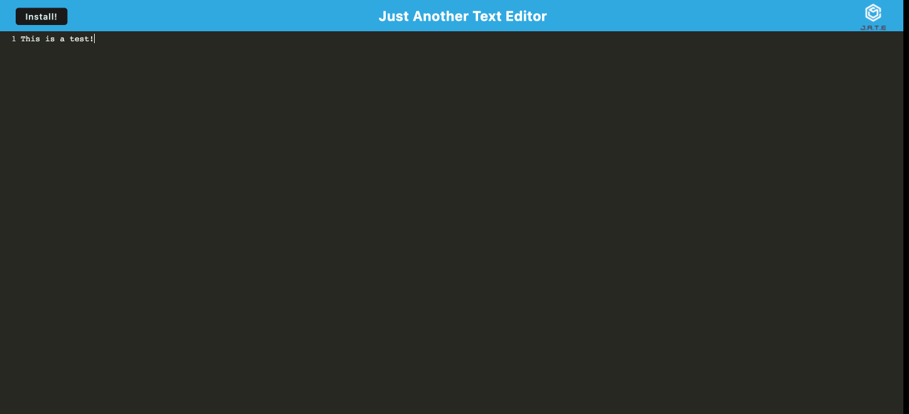
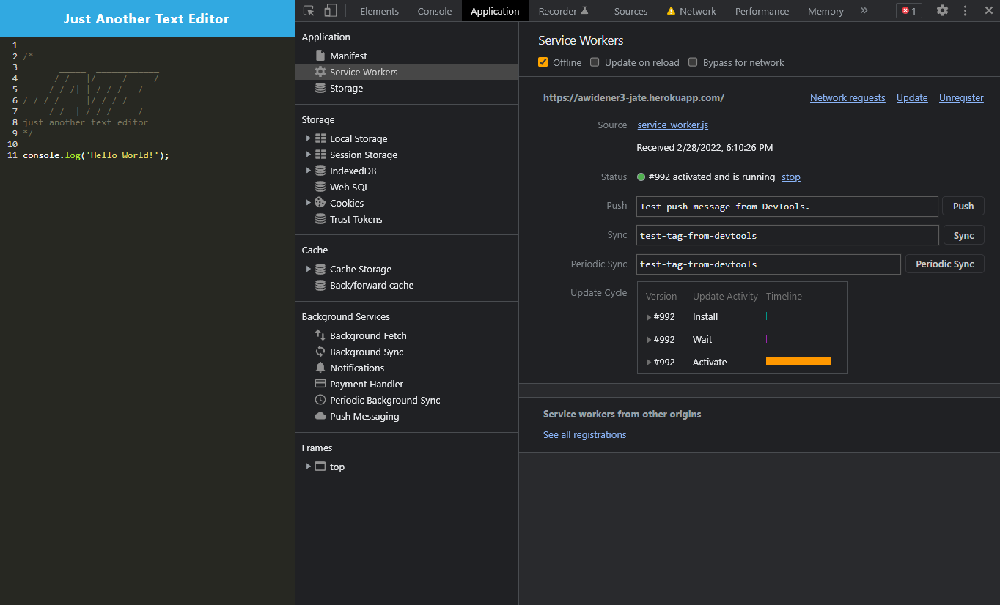

# PWA-Text-Editor

](https://lbesson.mit-license.org/)


## Description

Text editor that runs in the browser. The app will be a single-page application that meets the PWA criteria. Additionally, it will feature a number of data persistence techniques that serve as redundancy in case one of the options is not supported by the browser. The application will also function offline.

## User Story
```
AS A developer
I WANT to create notes or code snippets with or without an internet connection
SO THAT I can reliably retrieve them for later use
```
## Acceptance Criteria
```
GIVEN a text editor web application
WHEN I open my application in my editor
THEN I should see a client server folder structure
WHEN I run `npm run start` from the root directory
THEN I find that my application should start up the backend and serve the client
WHEN I run the text editor application from my terminal
THEN I find that my JavaScript files have been bundled using webpack
WHEN I run my webpack plugins
THEN I find that I have a generated HTML file, service worker, and a manifest file
WHEN I use next-gen JavaScript in my application
THEN I find that the text editor still functions in the browser without errors
WHEN I open the text editor
THEN I find that IndexedDB has immediately created a database storage
WHEN I enter content and subsequently click off of the DOM window
THEN I find that the content in the text editor has been saved with IndexedDB
WHEN I reopen the text editor after closing it
THEN I find that the content in the text editor has been retrieved from our IndexedDB
WHEN I click on the Install button
THEN I download my web application as an icon on my desktop
WHEN I load my web application
THEN I should have a registered service worker using workbox
WHEN I register a service worker
THEN I should have my static assets pre cached upon loading along with subsequent pages and static assets
WHEN I deploy to Heroku
THEN I should have proper build scripts for a webpack application
```
## Table of Contents

- [Application Preview](#application-preview)
- [Installation](#installation)
- [Usage](#usage)
- [Technologies](#technologies)
- [License](#license)
- [Questions](#questions)

### Application Preview



Using devtools, you can see both the Service Worker active, along with a loaded Manifest.


As you add and remove information, it is saved locally in IndexedDB


The app also works offline, thanks to the manifest and service worker



[Deployed Link](https://agile-brook-30852.herokuapp.com/)

### Installation
In order to use this code on your local machine download or clone this repository. Next
install necessary dependencies, navigate to the root directory and run the following command: 
```
npm i 
```
### Usage

- Run this application by opening the terminal in the root folder:
```
npm start
```
- Once the command is invoked the server will be started, go to the url of the application by typing `http//:localhost:3000` in the browser.
- Type any text into the editor. Your text will then be saved automatically when you click off of the window. 
- Refresh the page to see the text persistent and saved in the indexedDB.

Install this PWA onto your devices to be used offline  by pressing the install button. 

### Technologies

- Express.js
- Node.js
- IndexedDB
- PWA
- Heroku

### License 

This project is covered under the MIT license. To learn more about what this means, click the license button at the top.
## Questions
Ezinma Nwankwo 

A driven developer at the University of New Hampshire currently completing a certification in full-stack development.

* Email: ezinmark@gmail.com
* Github: https://github.com/Ezmaa
* LinkedIn: [Ezinma Nwankwo](linkedin.com/in/ezinma-nwankwo-3b7905234)